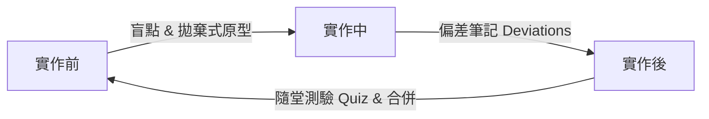

# Claude Fable 野外指南：尋找你的「未知」（Finding your unknowns）

*   **作者**：Thariq Shihipar (Anthropic 技術團隊成員)
*   **發表時間**：July 6, 2026

這篇文章分享了在使用 **Claude Code**（特別是配備 Fable 階段模型）進行 Agentic Coding（自主代理編碼）時，如何有條理地發現並解決「未知」的實戰模式。

---

## 🔗 參考資訊
*   **原文網址**：[Anthropic Blog: A field guide to Claude Fable 5: Finding your unknowns](https://claude.com/blog/a-field-guide-to-claude-fable-finding-your-unknowns)

---

## 🧭 核心觀念：地圖與疆域（The Map and the Territory）

在與 AI 代理協作時，作者常聯想到「地圖」與「疆域」的隱喻：
*   **地圖（The Map）**：我們提供給 Claude 的提示詞（prompts）、技能（skills）和脈絡（context），這是我們對工作的「想像與規劃」。
*   **疆域（The Territory）**：工作實際發生之處。包括程式碼庫（codebase）、現實世界的環境以及各種實際的限制。

**地圖與疆域之間的落差，就是「未知（Unknowns）」。**
當 Claude 在實作中遇到未知時，它只能根據對使用者意圖的「最佳猜測」來做決定。當任務規模越大、時間越長，Claude 遇到的未知就越多。

> [!IMPORTANT]
> 隨著 AI 模型的寫程式能力越來越強，開發品質的瓶頸已不再是「AI 能否寫出這段程式碼」，而是**「人類是否有能力在實作前、中、後，釐清並引導 AI 處理這些未知」**。


### 📊 視覺化：地圖與疆域的對齊循環
我們可以使用以下 Mermaid 關係圖來表達這個動態對齊的過程：

```mermaid
graph TD
    Map[地圖: 提示詞與背景規劃] -->|存在落差| Unknowns{未知物 Unknowns}
    Unknowns -->|實作阻礙| Territory[疆域: 專案程式碼與限制]
    
    subgraph 人機協同對齊 (Alignment Loop)
        Territory -->|1. 實作前: 盲點檢視 & 原型| Map
        Territory -->|2. 實作中: 偏差筆記| Map
        Territory -->|3. 實作後: 提案與測驗| Map
    end
```

---

## 🎨 推薦生圖 Prompt (AI Image Generation Prompts)
如果您需要為此主題生成精美的 16:9 科技插圖或 Banner，可以使用以下精心設計的 Prompt：

### 1. 概念配圖：解構未知，對齊地圖與疆域
> **Prompt:** A futuristic digital cartography scene, a developer using holographic interface to overlay a glowing golden tech map onto a physical dark silicon motherboard territory. Matrix code streams, neural networks, abstract glowing symbols representing unknown variables, morandi cool color palette (soft blues, teals, and sand gold), clean tech minimalist aesthetic, ultra-detailed, 16:9 aspect ratio --ar 16:9

### 2. 概念配圖：開發者與 AI 代理的親密協作
> **Prompt:** A software engineer pair programming with a friendly, glowing semi-transparent AI holographic assistant. They are looking at a vertical digital board showing a structured system architecture plan. Warm and cozy modern home-office desk setup, soft volumetric lighting, sketchnote doodle style diagrams on the background glass wall, clean tech illustration, --ar 16:9

---

## 🗂️ 未知的四個象限

當面對一個開發問題時，作者會將資訊劃分為以下四個象限：


```mermaid
matrix-card
  title "未知的四個象限 (Unknowns Matrix)"
  "Known Knowns\n(已知已知)" : "寫在提示詞（Prompt）中的明確需求。"
  "Known Unknowns\n(已知未知)" : "自己知道尚未搞懂、需要進一步探究或設計的部分。"
  "Unknown Knowns\n(未知已知)" : "對你來說太過理所當然（例如特定程式風格或業務邏輯），以至於沒寫下來，但一看到程式碼就能立刻辨認出對錯。"
  "Unknown Unknowns\n(未知未知)" : "完全沒想過、不知道其存在的知識或潛在死角。"
```

頂尖的 Agentic Coder 的特質在於：他們能將「未知」限縮到最小，並且對於不確定的部分保持假設，主動與 Claude 一起探索。

---

## ⚙️ 超敏捷工作流與實用 Prompt 範例

Thariq Shihipar 將協作流程分為三個階段，以分鐘為單位快速運轉：



### 一、 實作前（Pre-implementation）：發掘未知

#### 1. 盲點檢視（Blind Spot Pass）—— 針對「未知未知」
> **實用 Prompt：**
> ```text
> 我現在要在此專案中開發 [新增一個驗證模組]，但我對這個程式庫中相關的驗證架構完全不熟悉。請幫我做一次「盲點檢視（Blind Spot Pass）」，指出我有什麼相關的「未知未知（Unknown Unknowns）」，並協助我設計等一下可以如何更好地向你下提示詞。
> ```

#### 2. 腦力激盪與原型設計（Brainstorms and Prototypes）—— 針對「未知已知」
> **實用 Prompt：**
> ```text
> 在開始串接任何真正的後端邏輯或更新應用程式狀態之前，請先撰寫一個包含假資料的單一 HTML 檔案，用來模擬 [新的控制面板工具列]。我希望在我們動到真實專案程式碼前，先對這個版面配置與操作流程進行反應與調整。
> ```

#### 3. 逐題面試（Interviews）
> **實用 Prompt：**
> ```text
> 請一次只問我一個問題，對我進行需求訪談。請優先詢問那些如果我的回答改變，就會直接影響到底層架構設計或型別定義的問題。
> ```

#### 4. 提供參考資料（References）
*   直接指引 AI 閱讀其他模組的**原始碼**是最高效的參考方式。

#### 5. 撰寫實作計畫（Implementation Plans）
> **實用 Prompt：**
> ```text
> 請用 HTML/Markdown 寫一份實作計畫，但請把重點放在我最可能微調的決策上：例如資料模型的變更、新的型別介面，以及任何會影響到使用者的行為。至於機械式的程式碼重構細節，請放在最下面即可，那些部分我相信你。
> ```

---

### 二、 實作中（During implementation）：動態適應

#### 實作筆記（Implementation Notes）
> **實用 Prompt：**
> ```text
> 在實作過程中，請維持一份「implementation-notes.md」檔案。如果你遇到任何強迫你必須偏離原定計畫的邊緣個案（edge cases），請先選擇最保守的選項，並在該筆記的「變更與偏差（Deviations）」區塊中記錄下來，然後繼續進行。
> ```

---

### 三、 實作後（Post implementation）：知識同步與審查

#### 1. 提案包裝（Pitches and Explainers）
> **實用 Prompt：**
> ```text
> 請將我們的原型、規格書以及實作筆記，打包成一份可以發在 Slack 上的完整報告，以便向團隊爭取同意。報告的開頭請先放上動態展示圖（Demo GIF）。
> ```

#### 2. 隨堂測驗（Quizzes）
> **實用 Prompt：**
> ```text
> 我希望確保我完全理解了這一次程式碼變更的所有細節與影響。請提供一份變更報告，說明你的實作直覺、所做的修改，並在最下方出幾題隨堂測驗考考我，我必須完全答對才能進行 Merge。
> ```
